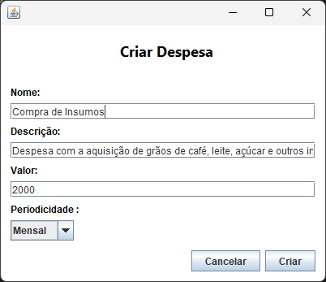
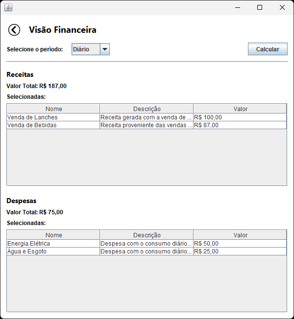

# Aplicativo de Gerenciamento Financeiro Pessoal

## Descrição

Um aplicativo de gerenciamento financeiro pessoal desenvolvido em Java, utilizando a biblioteca Swing para a interface gráfica e a IDE NetBeans. O objetivo é fornecer uma ferramenta simples e intuitiva para o controle de receitas e despesas.

## Funcionalidades

*   **Receitas:** Permite registrar fontes de renda.
*   **Despesas:** Possibilita o registro de despesas.
*   **Visão Financeira:** Exibe as receitas e despesas organizadas por períodos, para facilitar o acompanhamento financeiro.
*   **Orçamentos:** Auxilia no planejamento de gastos, permitindo a criação e o monitoramento de orçamentos para diferentes áreas ou projetos.

## Tecnologias Utilizadas

* [Java](https://www.java.com/pt-BR/): Linguagem da aplicação
* Swing: Interface gráfica
* [NetBeans](https://netbeans.apache.org/front/main/index.html): IDE de desenvolvimento

## Estrutura

O projeto utiliza o padrão MVC para estruturação das pastas e arquivos, organizados da seguinte forma:

```
financial_management/               # Nome do projeto
├── .idea/                          # Arquivos de configuração
├── lib/                            # Bibliotecas
├── screenshots/                    # Screenshots da aplicação
├── src/                            # Código-fonte
│ └── main/java/org/cafe/           # Pacote base do código-fonte
│    ├── core/                      # Arquivos de configuração
│    │ └── formatters/              # Funções de formatação de dados
│    ├── database/                  # Camada de acesso ao banco de dados
│    │ └── controllers/             # Controladores das entidades do banco de dados
│    ├── models/                    # Classes de modelo que representam as entidades
│    ├── utils/                     # Funções utilitárias
│    ├── views/                     # Componentes da interface gráfica (GUI)
│    │ └── components/              # Componentes da tela
│    └── Main.java                  # Ponto de entrada do sistema
├── resources/                      # Recursos estáticos
│   └── images/                     # Imagens
├── test/                           # Pasta de testes
├── .gitignore                      # Informa ao git quais pastas e arquivos ignorar
├── README.md                       # Documentação
├── database.sqlite                 # Banco de dados local (SQLite)
├── nbactions.xml                   # Arquivo de configuração do NetBeans
└── pom.xml                         # Arquivo de configuração do Maven
```

## Arquitetura

O projeto adota o padrão arquitetural **MVC (Model-View-Controller)**, que promove a separação de responsabilidades, facilitando a manutenção e testabilidade do código, ficando da seguinte maneira:

- **Model**: Responsável pela representação dos dados. Localizadas no diretório `models`, e com prefixo `Model`.
- **View**: Responsável pela apresentação dos dados ao usuário e interação com o sistema através de componentes gráficos (ex: janelas, botões, campos de texto).  As telas da aplicação são construídas utilizando a biblioteca Swing e estão localizadas no diretório `views`, com prefixo `View`.
- **Controller**: Atua como intermediário entre a View e o Model. Recebe as ações que devem ser executadas, como criação, atualização, remoção, acessar tela e dentre outras. Estão presentes nas classes `*Controller` dentro dos pacotes de visualização (e.g. `views/budgets`, `views/expenses`, `views/revenues`), recebendo o prefixo `Controller`.

## Execução

1. Clone o repositório do projeto:
```bash
git clone https://github.com/dariomatias-dev/financial_management.git
```

2 - Compile o projeto para um arquivo `jar`:
```bash
mvn clean package
```

3 - Use o seguinte comando para executar a aplicação:
```bash
java -jar target/financial_management-1.0-SNAPSHOT-jar-with-dependencies.jar
```

## Interface Gráfica

A interface gráfica da aplicação foi desenvolvida utilizando Java Swing, uma biblioteca para criação de interfaces de usuário. O Swing permite a construção de componentes gráficos como botões, campos de texto, tabelas e menus, proporcionando uma experiência fluida e intuitiva para o usuário. Para facilitar o desenvolvimento, a IDE NetBeans foi utilizada, oferecendo ferramentas visuais e suporte a recursos como arrastar e soltar, o que acelera o processo de criação e organização da interface. Com isso, a aplicação garante uma interação eficiente e agradável para o usuário final, com componentes altamente configuráveis e flexíveis.

### Telas

- **Tela Principal:**


- **Tela de Receitas:**

    Filtros: Texto, valor mínimo e máximo, e período.


Criar Receita:


- **Tela de Despesas:**

    Filtros: Texto, valor mínimo e máximo, e período.


Criar Despesa:



- **Tela de Visão Financeira:**



- **Tela de Orçamentos:**

    Filtros: Texto, status, valor mínimo e máximo, e data inicial e final.


Criar Orçamento:


- **Tela de Orçamento:**


Criar Item de Orçamento:


<br/>

### Diálogos

- **Tabela está vazia (mesmo aviso para remoção):**


- **Confirmar remoção de registro:**


- **Nenhum registro foi selecionado (mesmo aviso para remoção):**


- **Algum ou todos os campos não foram preenchidos:**


- **Inserido um valor númerico inválido, como caracteres não númericos:**


- **Data inicial posterior a data final:**


## Autores

Projeto desenvolvido por [Dário Matias Sales](https://github.com/dariomatias-dev), [Dario Arthur Moura Ramos](https://github.com/Dario-Arthur) e [Arthur dos Santos Lima](https://github.com/Fastusx).
